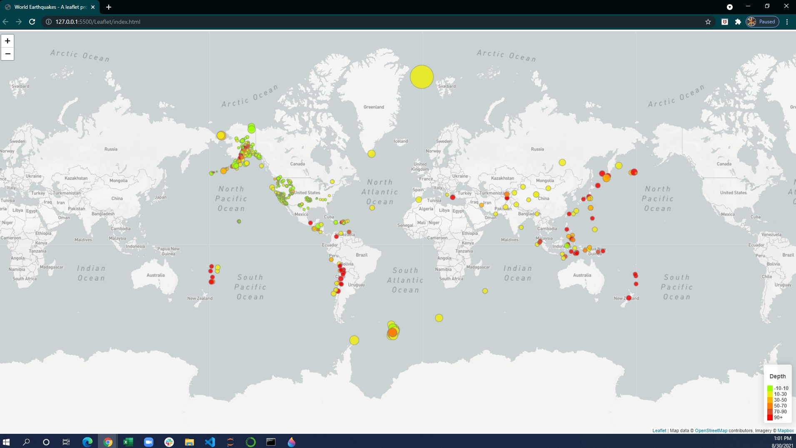
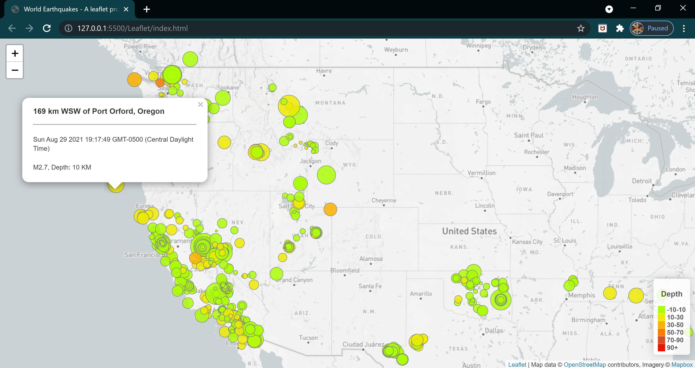

#  Visualizing Data with Leaflet

## Background

The USGS is responsible for providing scientific data about natural hazards, the health of our ecosystems and environment; and the impacts of climate and land-use change. Their scientists develop new methods and tools to supply timely, relevant, and useful information about the Earth and its processes. As a new hire, you will be helping them out with an exciting new project!

The USGS is interested in building a new set of tools that will allow them to visualize their earthquake data. They collect a massive amount of data from all over the world each day, but they lack a meaningful way of displaying it. Their hope is that being able to visualize their data will allow them to better educate the public and other government organizations (and hopefully secure more funding) on issues facing our planet.

### Level 1: Basic Visualization

Lets first visualize an earthquake data set.

1. **Source Data set**

   

   The USGS provides earthquake data in a number of different formats, updated every 5 minutes. [USGS GeoJSON Feed](http://earthquake.usgs.gov/earthquakes/feed/v1.0/geojson.php) page and pick a data set to visualize. Here I am using the link to fetch earthquakes data for all week by clicking "All Earthquakes" from the Past 7 Days. The link has JSON representation of that data. URL of this JSON is used to pull in the data for our visualization.

   

2. **Import & Visualize the Data**

   Created a map using Leaflet that plots all of the earthquakes from the data set based on their longitude and latitude.

   * Data markers reflect the magnitude of the earthquake by their size and and depth of the earthquake by color. Earthquakes with higher magnitudes appear larger and earthquakes with greater depth appear darker in color.

   * Each circular marker opens a popup that provides additional information about the earthquake when it is clicked.

   * The legend provides context for map data.
   
   

### Level 2: More Data

This is plot of a second data set on the map to illustrate the relationship between tectonic plates and seismic activity. The Data on tectonic plates can be found at <https://github.com/fraxen/tectonicplates>. Used the Url for tectonic plates and created visualization alongside original set of data. 

This step includes:

* Plotting a second data set on the map.

* Adding base maps to choose from as well as separate out two different data sets into overlays that can be turned on and off independently.

* Addig layer controls to our map.